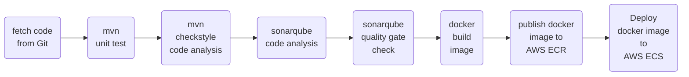

# Jenkinsfile-Docker-CI-CD

### Jenkinsfile flow :

### Steps :
#### <ins> *Note* </ins>  : Keep updating the Jenkinsfile while doing the following steps stage-by-stage.
- Create three servers for: ([Click here for installation and provisioning of the servers](https://github.com/yogeshgunasekaran/Automated-Provisioning-Project-2))
    - **Jenkins**
    - **SonarQube**
    - **Nexus**
- Log into Jenkins server as root user and install **docker engine** from the [official docker documentation](https://docs.docker.com/engine/install/#server)
   - Add the jenkins user into to docker group 
       ```sh 
       id jenkins 
       ```
       ```sh 
       usermod -a -G docker jenkins 
       ```
   - Install aws cli and reboot the server
       ```sh 
       apt install awscli -y 
       ```
       ```sh 
       reboot 
       ```
- Log into AWS <br>
    **Create IAM User and ECR repository:** <br>
    - In **IAM &rarr; Users &rarr; Add users**. Create a user **jenkins** and choose AWS credential type as **Access key - Programmatic access**  <br>
    - Attach existing policies directly with **AmazonEC2ContainerRegistryFullAccess** and **AmazonECS_FullAccess** <br>
    - In **ECR &rarr; Create respository**. Keep the visibility settings as 'Private' and a repository name. Copy and save the **repository URI** 
 
- In Jenkins - **Manage Plugins:**
  - add **SonarQube Scanner** plugin
  - add **Pipeline Maven Integration** plugin
  - add **Pipeline Utility Steps** plugin
  - add **Build Timestamp** plugin
  - add **Amazon ECR** plugin
  - add **Amazon Web Services SDK :: All** plugin
  - add **Docker Pipeline** plugin
  - add **CloudBees Docker Build and Publish** plugin
  
- In Jenkins - **Manage Credentials:**
  - Add credentials as **AWS Credentials**
  - Give the ID & Description as **awscred** and store the **Access key ID** and **Secret Access Key** here 
- In Jenkins - **Global Tool Configuration:**
  - Add **SonarQube Scanner**
    - configure sonarqube scanner with name as **sonar4.7**
    
- In Jenkins - **Configure System:** <br>
  - configure sonarqube server details and integrate it with jenkins,
    - checkbox the **Environmental variables**
    - add name as **sonar**
    - add server url **http ://sonarqube-ip:9000**
    - Go to **sonarqube server &rarr; administrator &rarr; Security &rarr; Generate tokens** 
    - Add credentials as **secret text** with sonarqube token and ID & Description as **MySonarToken**
  - configure Build Timestamp
    - checkmark **Enable Build Timestamp**
    - choose the required **timezone** and its **pattern** 
    
- In sonarqube, create **Quality Gate** with required **conditions**  
- In sonarqube, click our **project &rarr; project settings &rarr; select the Quality Gate** that has been created
- In sonarqube, click our **project &rarr; project settings &rarr; Webhooks &rarr; Create**
    - Give a name **jenkins-ci-webhook**
    - URL **http ://jenkins-ip-here:8080/sonarqube-webhook**
- In Jenkins, create a new **job** as **Pipeline** and paste the **Jenkinsfile script** in the script section with updated details

