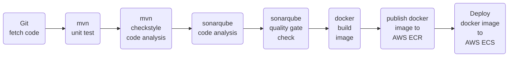

# Jenkinsfile-Docker-CI/CD-with-AWS
### What are ***Containers*** ?
Containers are a form of operating system virtualization. A single container might be used to run anything from a small microservice or software process to a larger application. Inside a container are all the necessary executables, binary code, libraries, and configuration files. Compared to server or machine virtualization approaches, however, containers do not contain operating system images. This makes them more lightweight and portable, with significantly less overhead. In larger application deployments, multiple containers may be deployed as one or more container clusters. Such clusters might be managed by a container orchestrator such as Kubernetes.

### What is ***Docker*** ?
Docker is an open platform for developing, shipping, and running applications. Docker is a platform which packages an application and all its dependencies together in the form of containers. This containerization aspect ensures that the application works in any environment. Each and every application runs on separate containers and has its own set of dependencies & libraries. This makes sure that each application is independent of other applications, giving developers surety that they can build applications that will not interfere with one another. So a developer can build a container having different applications installed on it and give it to the QA team. Then the QA team would only need to run the container to replicate the developer’s environment.

### What are ***Container hosting platforms*** ?
- Docker engine - for local development and testing environment 
- Kubernetes - for production environment
	- Standalone Kubernetes
	- Amazon Elastic Kubernetes Service (EKS)
	- Azure Container Service (AKS)
	- Google Kubernetes Engine (GKE)
	- Red Hat OpenShift
- Amazon Elastic Container Service (ECS) 

### Jenkinsfile flow :

### Steps :
#### <ins> *Note* </ins>  : Keep updating the Jenkinsfile in the pipeline job while doing the following steps stage-by-stage.
- Create three servers for: ([Click here for installation and provisioning of the servers](https://github.com/yogeshgunasekaran/Automated-Provisioning-Project-2))
    - **Jenkins**
    - **SonarQube**
    - **Nexus**
- Log into Jenkins server as root user and install **docker engine** from this [official docker documentation](https://docs.docker.com/engine/install/#server)
   - Add the jenkins user into to docker group 
       ```sh 
       id jenkins 
       ```
       ```sh 
       usermod -a -G docker jenkins 
       ```
   - Install aws cli and reboot the server
       ```sh 
       apt install awscli -y 
       ```
       ```sh 
       reboot 
       ```
- Log into AWS <br>
    - In **IAM &rarr; Users &rarr; Add users** 
   		- Create a user **jenkins** and choose AWS credential type as **Access key - Programmatic access**  
        - Assign policies for the **jenkins** user, click **Attach existing policies directly** and add **AmazonEC2ContainerRegistryFullAccess** and **AmazonECS_FullAccess** policies
    - In **ECR &rarr; Get started &rarr; Create respository** 
    	- Keep the visibility settings as 'Private' and a repository name.
		- Note the **repository URI** 
    - In **ECS &rarr;** click and switch to &rarr; **New ECS Experience** &rarr; **Get started &rarr; Create cluster**
    	- Give a **Cluster name** as **sampleapp**
		- Keep **VPC** and **subnets** as default
		- Infrastructure as **AWS Fargate (serverless)** would have been selected by default
		- In **Monitoring - optional** section, checklist **Use Container Insights** and finally click **Create**
		- Once the cluster has been created, click the hamburger button on the top left-hand side and go to the **Task Definitions** &rarr; **Create new Task Definition**. Give Task definition name as **sampleapptask**. Choose **Operating system family** as **Linux**, **Task memory** as **2GB(minimum)** and **Task CPU** as **1vCPU(minimum)**. Click **Add container** &rarr; give container name as **sampleapp** and in **image** copy-paste the ECR docker build image **URI**, add the respective container **port mappings** for the applications thats runs in the container. Keep the remaining options as is in default and **Create** task definition.
		- Now, in **Clusters &rarr; sampleapp &rarr;** in services section **Deploy**
 
- In Jenkins - **Manage Plugins:**
  - add **SonarQube Scanner** plugin
  - add **Pipeline Maven Integration** plugin
  - add **Pipeline Utility Steps** plugin
  - add **Pipeline: AWS Steps** plugin
  - add **Build Timestamp** plugin
  - add **Amazon ECR** plugin
  - add **Amazon Web Services SDK :: All** plugin
  - add **Docker Pipeline** plugin
  - add **CloudBees Docker Build and Publish** plugin
  
- In Jenkins - **Manage Credentials:**
  - Add credentials as **AWS Credentials**
  - Give the ID & Description as **awscred** and store the **Access key ID** and **Secret Access Key** here 
- In Jenkins - **Global Tool Configuration:**
  - Add **SonarQube Scanner**
    - configure sonarqube scanner with name as **sonar4.7**
    
- In Jenkins - **Configure System:** <br>
  - configure sonarqube server details and integrate it with jenkins,
    - checkbox the **Environmental variables**
    - add name as **sonar**
    - add server url **http ://sonarqube-ip:9000**
    - Go to **sonarqube server &rarr; administrator &rarr; Security &rarr; Generate tokens** 
    - Add credentials as **secret text** with sonarqube token and ID & Description as **MySonarToken**
  - configure Build Timestamp
    - checkmark **Enable Build Timestamp**
    - choose the required **timezone** and its **pattern** 
    
- In sonarqube, create **Quality Gate** with required **conditions**  
- In sonarqube, click our **project &rarr; project settings &rarr; select the Quality Gate** that has been created
- In sonarqube, click our **project &rarr; project settings &rarr; Webhooks &rarr; Create**
    - Give a name **jenkins-ci-webhook**
    - URL **http ://jenkins-ip-here:8080/sonarqube-webhook**
- In Jenkins, create a new **job** as **Pipeline** and paste the **Jenkinsfile script** in the script section with updated details

